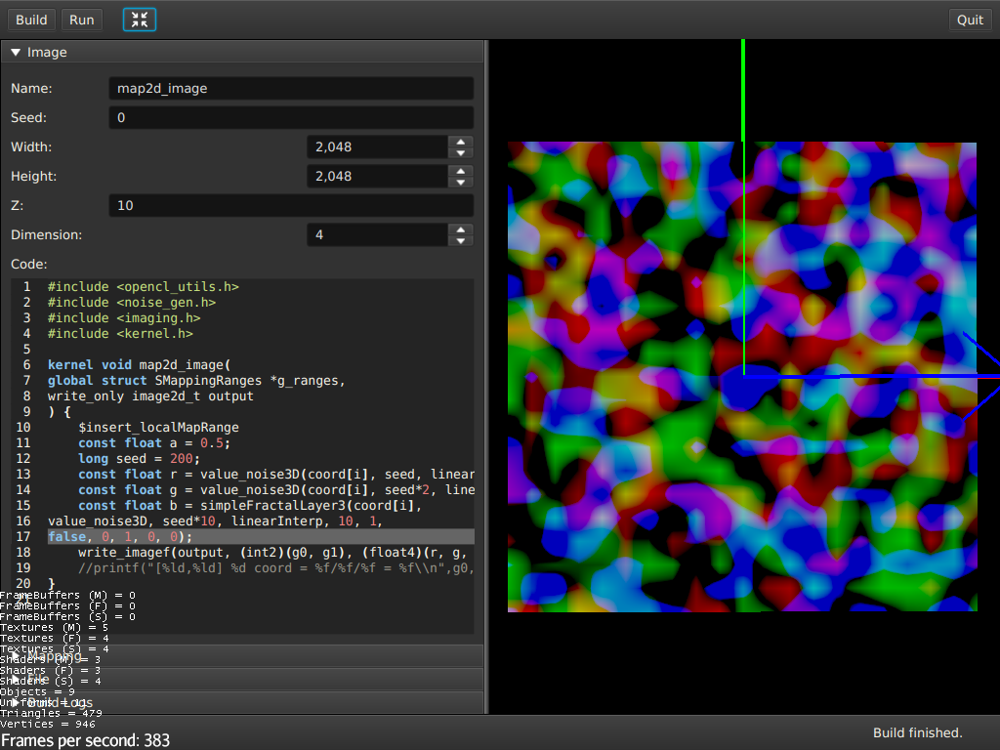

ANL-OPENCL
=== 

Introduction
---



The project is a rework of the Accidental-Noise Josua Tippetts' C++ library
in OpenCL. ANL-OPENCL will be used in a Java application via the Aparapi
library at a later stage. The C code in `src/main/cpp` can be compiled into
a OpenCL kernel and to be used to generate random noise like in the original
Accidental-Noise library. There are tests for both the C and OpenCL kernels
in `src/test/cpp`.

Examples
---

There are examples for each noise function in `src/test/cpp`.

### combineRGBA_simpleBillow


```
#include <noise_gen.h>
#include <kernel.h>

kernel void combineRGBA_simpleBillow(
global float3 *input,
global float4 *output
) {
	int id0 = get_global_id(0);
	kiss09_state srnd;
	kiss09_seed(&srnd, 200);

	input[id0] = scaleDomain(input[id0], 5.0f);

	float bm = simpleBillow3(input[id0], value_noise3D, 200, linearInterp, random_kiss09, &srnd, 1, 0.125, true);
	float r = bm * 0.5 + 0.5;

	bm = simpleBillow3(input[id0], value_noise3D, 2000, linearInterp, random_kiss09, &srnd, 1, 0.125, true);
	float g = bm * 0.5 + 0.5;

	bm = simpleBillow3(input[id0], value_noise3D, 4000, linearInterp, random_kiss09, &srnd, 1, 0.125, true);
	float b = bm * 0.5 + 0.5;

	output[id0] = combineRGBA(r, g, b, 1.0);
}

```

### cellular_function3D


```
#include <noise_gen.h>
#include <kernel.h>

REAL f[] = { 10, 5, 2.5, 1.25 };
REAL disp[] = { 100, 50, 25, 10 };

kernel void cellular_function3D_distEuclid(
global vector3 *input,
global REAL *output
) {
	int id0 = get_global_id(0);
	output[id0] = cellular_function3D(input[id0], 200, f, disp, distEuclid3);
}

```

Features
---

### Higher dimensions noise functions

All noise functions and utilities functions are available for the dimensions

- 2D and vector2 type,
- 3D and vector3 type,
- 4D and vector4 type,
- 6D and vector8 type.

### Both 32-bit and 64-bit floating-point supported

The code can be used for both 32-bit and 64-bit floating-point numbers using the
precompiler flag `ANLOPENCL_USE_DOUBLE` 
and the types `REAL`, `vector2`, `vector3`, `vector4` and `vector8`.
Although, it makes little to no 
difference using 64-bit floating-point to generate the noise for the end result.

### Bundles the bstatcomp/RandomCL to be used in OpenCL kernel

Bundles the bstatcomp/RandomCL for generating random numbers in the OpenCL 
kernel.

https://github.com/bstatcomp/RandomCL

### Code can be used in a C program or OpenCL kernel

Using the clang vector extension it is possible to use the same code in a 
C/C++ program or in a OpenCL kernel. That enables me to test the code via
Google-Test framework before it is used in a OpenCL kernel. The precompiler
flag `ANLOPENCL_USE_OPENCL` is set if the code is compiled for a OpenCL kernel.

https://clang.llvm.org/docs/LanguageExtensions.html#vectors-and-extended-vectors

### Library can be pre-build for OpenCL kernel

The ANL-OPENCL code can be bundled and pre-build as a OpenCL library.

License
---

Copyright (C) 2021 Erwin Müller <erwin@muellerpublic.de>
Released as open-source under the Apache License, Version 2.0.

****************************************************************************
ANL-OpenCL :: Core
****************************************************************************

Copyright (C) 2021 Erwin Müller <erwin@muellerpublic.de>

Licensed under the Apache License, Version 2.0 (the "License");
you may not use this file except in compliance with the License.
You may obtain a copy of the License at

     http:www.apache.org/licenses/LICENSE-2.0

Unless required by applicable law or agreed to in writing, software
distributed under the License is distributed on an "AS IS" BASIS,
WITHOUT WARRANTIES OR CONDITIONS OF ANY KIND, either express or implied.
See the License for the specific language governing permissions and
limitations under the License.

****************************************************************************
ANL-OpenCL :: Core is a derivative work based on Josua Tippetts' C++ library:
http:accidentalnoise.sourceforge.net/index.html
****************************************************************************

Copyright (C) 2011 Joshua Tippetts

  This software is provided 'as-is', without any express or implied
  warranty.  In no event will the authors be held liable for any damages
  arising from the use of this software.

  Permission is granted to anyone to use this software for any purpose,
  including commercial applications, and to alter it and redistribute it
  freely, subject to the following restrictions:

  1. The origin of this software must not be misrepresented; you must not
     claim that you wrote the original software. If you use this software
     in a product, an acknowledgment in the product documentation would be
     appreciated but is not required.
  2. Altered source versions must be plainly marked as such, and must not be
     misrepresented as being the original software.
  3. This notice may not be removed or altered from any source distribution.


